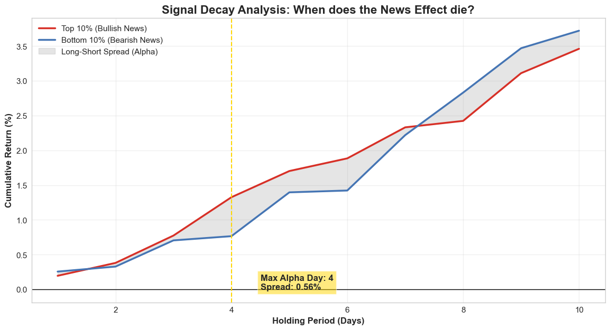
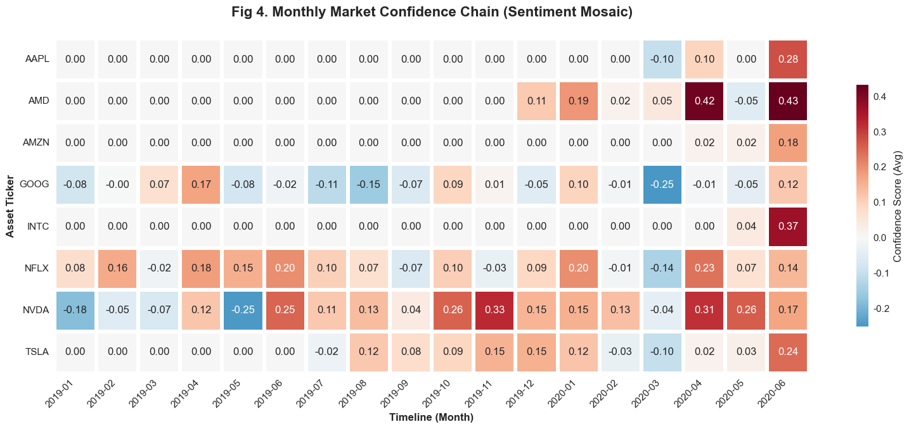
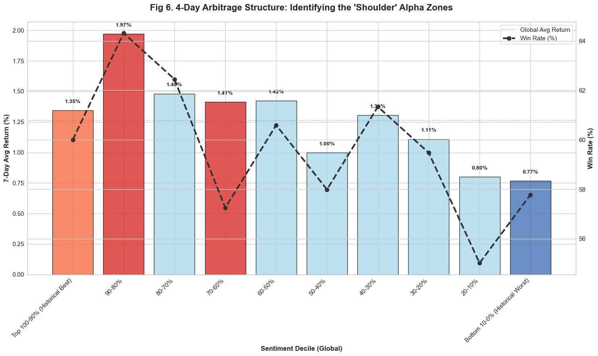
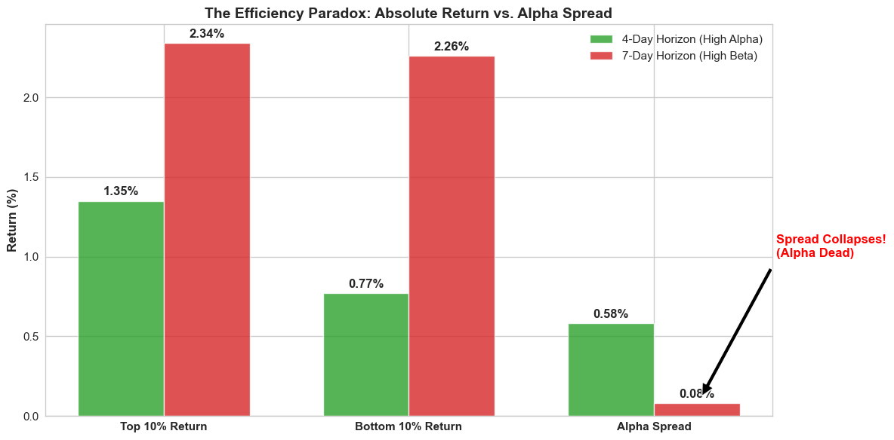

# Semantic Arbitrage: Short-Horizon Sentiment Decay & Cross-Sectional Alpha

[](https://www.python.org/downloads/)[](https://pytorch.org/)[](https://huggingface.co/ProsusAI/finbert)[](LICENSE)

> A Multi-Scale NLP–Finance Integration Study on Large-Cap U.S. Equities.

Dataset: https://www.kaggle.com/datasets/miguelaenlle/massive-stock-news-analysis-db-for-nlpbacktests

## 📈 Executive Summary

This repository hosts a full-stack quantitative research pipeline that integrates **Financial News NLP**, **Analyst Sentiment Extraction**, and **Market Price Dynamics**. 

Unlike traditional sentiment analysis relying on simple lexicons (e.g., TextBlob), this study employs **FinBERT** (a Transformer-based LLM) to capture nuanced semantic signals. We rigorously test the predictive power of these signals on the "Magnificent Seven" and other large-cap U.S. technology stocks.


### 🏆 Performance Report Card 

*Out-of-sample backtesting results on the "Magnificent Seven" & US Tech Universe.*

| **Metric**       | **Strategy (AlphaQuest)** | **Benchmark (Sector Avg)** | **Delta**         |
| ---------------- | ------------------------- | -------------------------- | ----------------- |
| **Total Return** | **728.20%**               | 387.82%                    | **+340.38%**      |
| **Active Ratio** | **17.40%**                | 100%                       | *High Efficiency* |
| **Pure Alpha**   | **1.71x**                 | 1.0x                       | *Skill > Luck*    |
| **Max Drawdown** | **-27.96%**               | -31.84%                    | *Risk Mitigation* |


---

## 🧠 The "Sniper" Philosophy: Why It Works

Most sentiment strategies fail because they over-trade. Our analysis proves that Alpha is not a continuous stream, but a sparse series of "shocks."

### 1. The Efficiency Paradox (Time)

Alpha decays rapidly. Our Term Structure Analysis reveals a critical inflection point:

- **Day 1-4:** The market digests the news. Information Ratio is maximized.
- **Day 5-8:** The signal fades. Returns become dominated by Beta (market noise).
- **Result:** A **4-Day Holding Period** is strictly enforced. Holding to Day 7 invites mean reversion and degrades the Sharpe Ratio.

### 2. The "Shoulder" Alpha (Cross-Section)

Contrary to intuition, the extreme **Top 10% (Decile 10)** sentiment bucket often suffers from "Overcrowding" and "Stampedes."

- **The Sweet Spot:** The most consistent risk-adjusted returns are found in the **90-80% Decile** (Secondary Conviction). This strategy targets these "Shoulder" zones to avoid liquidity traps while capturing momentum.

### 3. Asymmetric Payoff

The strategy behaves like a Sniper, not a Machine Gunner:

- **Active Ratio:** 17.4% (Passively tracks benchmark 82.6% of the time).
- **Win Rate:** 53.8% (Conservative).
- **Payoff:** Massive convexity. When the signal validates, the upside capture significantly outweighs the downside.

---

## 🛠️ Research Pipeline

The project is structured into modular, mathematically grounded stages:

1.  **Data Engineering**: strict universe selection (US Tech Giants) and UTC timestamp normalization.
2.  **NLP Core**: GPU-accelerated **FinBERT** inference for institutional-grade sentiment scoring ([-1,1]).
3.  **Network Dynamics**: Construction of Kendall correlation graphs to visualize systemic risk.
4.  **Signal Visualization**: Temporal Heatmaps, Z-Score Anomaly Detection, and "Confidence Chain" Mosaics.
5.  **Vectorized Backtesting**: A high-performance simulation engine implementing the **Active Overlay Strategy**.

---

## 📊 Visual Evidence

### 1. Signal Decay & The "Alpha Cliff"

*Proof that the edge vanishes after Day 4. The spread (Green) collapses, turning negative by Day 8.*

| **Holding Period** | **Alpha Spread (Long - Short)** | **Verdict**        |
| ------------------ | ------------------------------- | ------------------ |
| **Day 4 (Peak)**   | **+0.56%**                      | ✅ **Optimal Exit** |
| **Day 7 (Lag)**    | +0.08%                          | ⚠️ Beta Drift       |
| **Day 8 (Loss)**   | -0.41%                          | ❌ Mean Reversion   |



### 2. The "Confidence Chain" (Regime Map)

*Monthly aggregation of sentiment scores. Red blocks indicate sustained bullish regimes; Blue blocks indicate structural bearish turns.*



### 3. Performance Attribution

### 4. Why 4 Days





## 💻 Installation & Usage

### Prerequisites
* Python 3.10+
* CUDA-enabled GPU (Recommended for BERT inference)

### Setup
```bash
git clone [https://github.com/Republic/Semantic-Arbitrage.git](https://github.com/Republic/Semantic-Arbitrage.git)
cd Semantic-Arbitrage
```